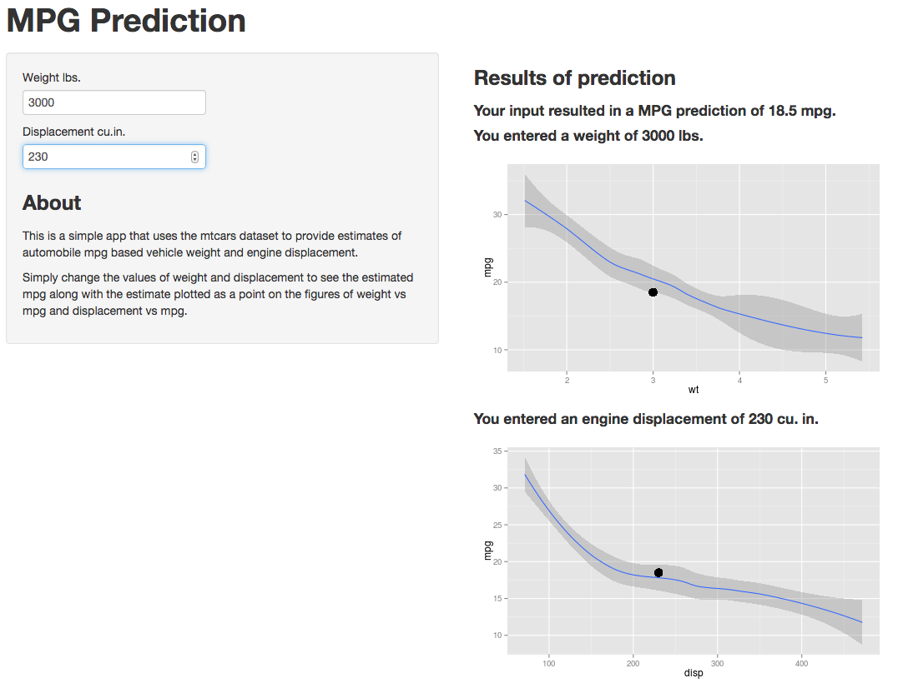

## Why Is Fuel Economy Important?

1. Saves You Money
2. Reduces Climate Change
3. Reduces Oil Dependence Costs
4. Increases Energy Sustainability  
  
List taken from: http://www.fueleconomy.gov/feg/why.shtml

--- .class #id 

## Estimation of Vehicle MPG

We have developed a tool to estimate the expected miles per gallon of a vehicle given its weight and displacement.
These factors were chosen based on step-wise creation of a linear model from the data supplied in the `mtcars` dataset in R. Loess smoothed lines and 95% confidence intervals are displayed on plots of weight vs mpg and displacement vs mpg to help you set your parameters. Values that produce a dot outside of the interval are not mpg estimates that are modeled well by this program.  
  
```{r,echo=FALSE,message=FALSE,fig.width=14,fig.height=5}
require(gridExtra)
require(stats)
require(ggplot2)
library(datasets)
data(mtcars)
modfit <- lm(mpg~I(1/disp)+log(wt),data = mtcars)
mpgEst <- function(wt,disp){
    round(as.double(modfit$coefficients[1]
                    +modfit$coefficients[2]*(1/disp)
                    +modfit$coefficients[3]*log(wt/1000)),1)
    }

mpg_est1 <<- mpgEst(3000,130)
mpg_est2 <<- mpgEst(3000,230)
g1 <- ggplot(mtcars) + geom_smooth(aes(x=wt,y=mpg),method='loess',data = mtcars) +
                 geom_point(aes(x=3,y=mpg_est1),size=3)

g2 <- ggplot(mtcars) +
                 geom_smooth(aes(x=disp,y=mpg),method='loess',data = mtcars) +
                 geom_point(aes(x=130,y=mpg_est1),size=3)
g3 <- ggplot(mtcars) + geom_smooth(aes(x=wt,y=mpg),method='loess',data = mtcars) +
                 geom_point(aes(x=3,y=mpg_est2),size=3)

g4 <- ggplot(mtcars) +
                 geom_smooth(aes(x=disp,y=mpg),method='loess',data = mtcars) +
                 geom_point(aes(x=230,y=mpg_est2),size=3)
grid.arrange(g1,g3,g2,g4)
```

--- .class #id 

## Use cases

1. Consumers evaluating different engine options
2. Vehicle manufacturers evaluating new car designs
3. Regulatory bodies looking to create or modify legislation

--- .class #id 

## Simple example

We want to evaluate the mpg difference between two 3000 lb cars. One with a 130 cu.in. engine, and a second with a 230 cu.in. engine. By simply setting the weight value to 3000 lbs, you can step through the different displacement values, seeing how the change in displacement maps against mpg, and also noting the output mpg value. Below we show screenshots of the initial and final states of the app under this example.



